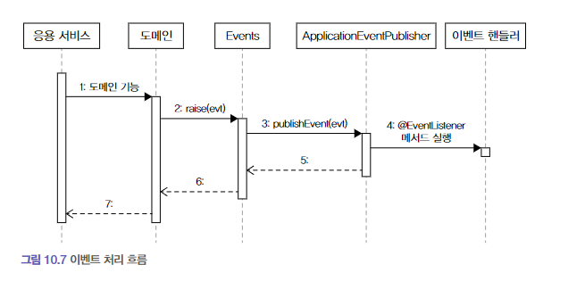

# 이벤트

## 시스템 간 강결합 문제
- 환불기능
  - 주체는 주문 도메인 엔티티
    - 처리는 도메인에 service를 파라미터로 받아서 처리
      - 설계상 문제가 나타날 수 있음.
      - 도메인에서 주문 로직과 결제 로직이 섞이는 문제가 발생
        - 환불 기능이 바뀌면 Order도 영향을 받을 수 있음.
    - 외부에 결제 시스템이 제공하는 환불 service 호출
      - 외부 서비스가 정상이 아닐 경우 트랜잭션 처리 애매.
      - 외부 서비스의 응답 시간에 따라 성능 문제 발생. (외부 시스템에 직접적인 영향을 받음)
- 위 무넺들은 결국, 주문 바운디드 컨텍스트와 결제 바운디드 컨텍스트 간의 강결합 문제 때문이다.
- 강한 결합을 없애려면 비동기 이벤트를 사용하면 두 시스템 간의 결합을 크게 낮출 수 있다.


## 이벤트 개요
- 이벤트 라는 용어는 '과거에 벌어진 어떤 것'을 의미한다.


### 이벤트 관련 구성 요소
- 도메인 모델에 이벤트를 도입하려면 네 개의 구성요소를 구현해야 한다.
  - 이벤트
  - 이벤트 생성 주체
  - 이벤트 디스패처 (퍼블리셔)
  - 이벤트 핸들러 (이벤트 구독자)

- 이벤트 생성 주체
  - 엔티티, 밸류, 도메인 서비스와 같은 도메인 객체
  - 이들 도메인 객체는 도메인 로직을 실행해서 상태가 바뀌면 관련 이벤트를 발생시킨다.
- 이벤트 핸들러
  - 이벤트 생성 주체가 발생한 이벤트에 반응한다.
  - 이벤트에 담긴 데이터를 이용해서 원하는 기능을 실행한다.
- 이벤트 디스패처
  - 이벤트 생성 주체와 이벤트 핸들러를 연결해주는 것
  - 전파
  - 동기/비동기 처리

### 이벤트의 구성
- 이벤트 종류
  - 클래스 이름으로 이벤트 종류를 표현
- 이벤트 발생 시간
- 추가 데이터
  - 주문번호, 신규 배송지 정보 등 이벤트와 관련된 정보

---
- 클래스 이름은 과거 시제를 사용한다. (ex. Changed)
- 이벤트는 데이터를 담아야 하지만, 그렇다고 이벤트 자체와 관련 없는 데이터를 포함할 필요는 없다.


### 이벤트 용도
- 이벤트는 크게 두 가지 용도르 쓰인다.
  - 트리거
    - 도메인의 상태가 바뀔 때 다른 후처리가 필요한 경우, 후 처리를 실행하기 위한 트리거로 이벤트를 사용할 수 있다.
      - 주문 취소 시, 환불 처리
      - SMS로 예매 결과를 통보할 때.
  - 서로 다른 시스템 간의 데이터 동기화
    - 배송지 변경 시, 외부 배송 서비스에 바뀐 배송지 정보를 전송해야 한다.

### 이벤트 장점
- 이벤트를 사용하면 서로 다른 도메인 로직이 섞이는 것을 방지할 수 있다.
  - 다른 도메인으로의 의존 제거
- 이벤트 핸들러를 사용하면 기능 확장도 용이하다.
  - ex. 구매 취소 시, 환불과 함께 이메일로 취소 내용을 보내고 싶다면 이메일 발송을 처리하는 핸들러를 구현하면 된다.
  - 기능을 확장해도 구매 취소 로직은 수정할 필요가 없다.

## 이벤트, 핸들러, 디스패처 구현
- 이벤트 클래스 : 이벤트를 표현한다.
- 디스패처 : 스프링이 제공하는 ApplicationEventPublisher 이용한다.
- Events : 이벤트를 발행한다. 이벤트 발행을 위해 ApplicationEventPublisher 사용한다.
- 이벤트 핸들러 : 이벤트를 수신해서 처리한다. 스프링이 제공하는 기능을 사용한다.

> 이벤트 디스패처를 직접 구현할 수도 있지만, 이 책에서는 스프링이 제공하는 이벤트 관련 기능을 사용해서 이벤트 발생과 처리를 구현한다.

### 이벤트 클래스
- 상위 타입이 존재하는건 아니고 원하는 클래스를 이벤트로 사용하면 됨.
- 과거 시제
- 접미사로 Event를 사용
- 이벤트를 처리하는데 최소한의 데이터는 포함
- 상속 클래스로 공통 데이터를 가지게 할 수 있음.
  - 이벤트 처리 시간.

### Events 클래스와 ApplicationEventPublisher
```
public class Events { 
    private static ApplicationEventPublisher publisher;
    
    static void setPublisher(ApplicationEventPublisher publisher) {
        Events.publisher = publisher;
    }
    
    public static void raise(Object event) {
        if (publisher != null) {
            publisher.publishEvent(event);
        }
    }
    
}
```

- ApplicationEventPublisher 를 사용해서 이벤트를 발생시키도록 구현
  - `tatic 은 도메인 내에서 이벤트 발행할 수 있도록 Bean으로 의존성을 받는 방식이 아니라, static으로 한 것 같음...?`

### 이벤트 발생과 이벤트 핸들러
```
@EvetListener(OrderCanceledEvent.class)
public void handle(OrderCanceledEvent event) {
    refundService.refund(event.getOrderNumber());
}
```

- 맞는 클래스 붙어있는 리스너를 찾아 실행.

### 흐름 정리


- 코드 흐름을 보면 응용 서비스와 동일한 트랜잭션 범위에서 이벤트 핸들러를 실행하고 있다.
- 즉, 도메인 상태 변경과 이벤트 핸들러는 같은 트랜잭션 범위에서 실행된다.
  - `이벤트를 쓰면 따로 트랜잭션 관리를 해줘야 하는것이 아닌가...?????`


## 동기 이벤트 처리 문제
- 이벤트로 처리 하더라도, 문제가 하나 있음.
  - 외부 서비스에 영향을 받는 문제.
  - 트랜잭션은 롤백? 어떻게?
- 외부 시스템과의 연동을 동기로 처리할 때 발생하는 성능과 트랜잭션 범위 문제를 해소하는 방법은 
  - 이벤트를 비동기로 처리하거나, 
  - 이벤트와 트랜잭션을 연계하는 것.

## 비동기 이벤트 처리
- `A하면 이어서 B하라` 
  - 별도 스레드로 B를 수행하는 핸들러를 실행하는 방식으로 구현 가능
    - 로컬 핸들러로 비동기로 실행하기
    - 메시지 큐
    - 이벤트 저장소와 이벤트 포워더 사용하기
    - 이벤트 저장소와 이벤트 제공 API를 사용하기

### 로컬 핸들러 비동기 실행
- @Async
  - @EnableAsync : 비동기 기능 활성화
  - 이벤트 핸들러 메서드에 @Async

### 메시징 시스템을 이용한 비동기 구현
- Kafka or RabbitMQ
- 이벤트 발생 시, 이벤트 디스패처는 이벤트를 메시지 큐에 보냄.
- 메시지 큐는 이벤트를 메시지 리스너에 전달하고, 메시지 리스너는 알맞은 이벤트 핸들러를 이용해서 이벤트를 처리한다.

> 이 때, 이벤트를 메시지 큐에 저장하는 과정과 메시지 큐에서 이벤트를 읽어와 처리하는 과정은 별도 스레드나 프로세스로 처리한다.

- 필요하다면 이벤트를 발생시키는 도메인 기능과 메시지 큐에 이벤트를 저장하는 절차를 한 트랜잭션으로 묶어야 한다.
  - 글로벌 트랜잭션이 필요.
    - 안전하게 이벤트를 메시지 큐에 전달 가능하지만, 성능이 떨어질 수 있음.
- 메시지 큐를 사용하다 보면 이벤트 발생 JVM과 이벤트 처리 JVM이 다름
  - 동일 JVM에서 비동기 처리를 위해 메시지 큐를 사용하는 것은 시스템을 복잡하게 만들 뿐.

### 이벤트 저장소를 이용한 비동기 처리
- 이벤트를 DB에 저장 후, 별도 프로그램을 이용해서 이벤트 핸들러에 전달
  - 포워더는 주기적으로 이벤트 저장소에서 이벤트를 가져와 이벤트 핸들러를 실행한다.
  - 포워더는 별도 스레드를 이용하기 때문에 비동기.
  - 동일한 DB 사용
    - 즉, 도메인 상태 변화와 이벤트 저장이 로컬 트랜잭션으로 처리된다.
    - 물리적 저장소에 저장하기 때문에 처리에 실패하더라도 다시 읽어와 처리할 수 있음.
- 두 번째 방법은 이벤트를 외부에 제공하는 API를 사용하는 것.
  - 외부 핸들러가 API 서버를 통해 이벤트 목록을 가져간다.

- EventEntry : 이벤트 저장소에 보관할 데이터
  - id
  - type
  - contentType
  - payload
    - 객체를 직렬화 해서 저장
  - timestamp
- EventStore : 이벤트를 저장하고 조회하는 인터페이스 제공
- JdbcEventStore : 구현
- EventApi : Rest API를 이용해서 이벤트 목록을 제공하는 컨트롤러

- 이벤트는 과거에 벌어진 사건이므로 데이터가 변경되지 않는다.

#### 이벤트 저장을 위한 이벤트 핸들러 구현

- @EventListener(Event.class)

#### REST API 구현
- offset / limit 을 파라미터로 받는 api 제공

---
- API를 사용하는 클라이언트는 일정 간격으로 다음 과정 실행
1. 가장 마지막에 처리한 데이터의 offset인 lastOffset을 구한다. 저장한 lastOffset이 없으면 0을 사용
2. 마지막에 처리한 lastOffset을 offset으로 사용해서 API를 실행한다.
3. API 결과로 받은 데이터를 처리한다.
4. offset + 데이터 개수를 lastOffset으로 저장한다.

- 이벤트 중복을 방지하기 위한 lastOffset


#### 포워더 구현
- 스케줄러로 `eventStore.get(nextOffset, limitSize);`
