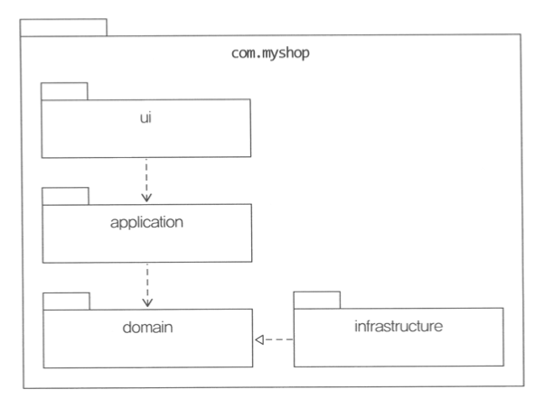

# 아키텍처 개요

## 네 개의 영역
- `표현`, `응용`, `도메인`, `인프라스트럭처` 는 아키텍처를 설계할 때 출현하는 전형적인 네 가지 영역이다.
- `표현 영역`
  - 사용자의 요청을 전달받아서 `응용` 영역에서 필요로 하는 형식으로 변환해서 전달하고, 응답받아 HTTP와 같은 응답으로 변환하여 전송.
- `응용 영역`
  - 표현 영역을 통해 사용자의 요청을 전달받음.
  - 시스템이 사용자에게 제공해야 할 기능을 구현
    - `주문 등록`, `주문 취소`, `상품 상세 조회` 등..
  - 기능을 구현하기 위해 도메인 영역의 도메인 모델을 사용한다.
  <pre><code>public class CancelOrderService {
        @Transactional
        public void cancelOrder(String orderId) {
            Order order = findOrderById(orderId);
            if (order == null) throw new ~
            order.cancel();
        }
  }
  </code></pre>
  - 응용 서비스는 로직을 직접 수행하기 보다는 도메인 모델에 로직 수행을 위임한다.
    - 실제 도메인 로직 구현은 도메인 모델에서!
- `도메인 영역`
  - 도메인 모델을 구현한다.
    - Order, OrderLine, ShippingInfo와 같은 도메인 모델이 이 영역에 위치함.
  - 도메인의 핵심 로직을 구현한다.
    - `배송지 변경`, `결제 완료`, `주문 총액 계산` 과 같은 핵심 로직을 도메인 모델에서 구현
- `인프라스트럭처 영역`
  - 구현 기술에 대한 것을 다룬다.
    - RDBMS, 메시징 큐, 몽고DB, SMTP, HTTP 등.. 
  - 논리적인 개념을 표현하기보다는 실제 구현을 다룬다.

- 도메인 영역, 응용 영역, 표현 영역은 구현 기술을 사용한 코드를 직접 만들지 않는다.
- 대신 인프라스트럭처 영역에서 제공하는 기능을 사용해서 필요한 기능을 개발한다.

## 계층 구조 아키텍처
- `표현` -> `응용` -> `도메인` -> `인프라스트럭처`
- 계층 구조는 그 특성상 상위 계층에서 하위 계층으로의 의존만 존재하고, 하위 계층은 상위 계층에 의존하지 않는다.
- 계층 구조를 엄격하게 적용한다면 상위 계층은 바로 아래의 계층에만 의존을 가져야 하지만 구현의 편리함을 위해 계층 구조를 유연하게 적용하기도 한다.
  - ex) 응용 -> 인프라스트럭처
- 이러면, 표현, 응용, 도메인 계층이 상셍한 구현 기술을 다루는 인프라스트럭처 계층에 종속된다.
<pre>
<code>
public class DroolsRuleEngine {
    private KieContainer kContainer;
    
    public DroolsRuleEngine() {
        KieServices ks = KieServices.Factory.get();
        kContainer = ks.getKieClasspathContainer();
    }

    public void evalute(String sessionName, List<?> facts) {
        KieSession kSession = kContainer.newKieSession(sessionName);
        try {
            facts.forEach(x -> kSession.insert(x));
            kSession.fireAllRules();
        } finally {
            kSession.dispose();
        }
    }
}
// 응용 영역은 가격 계산을 위해 인프라스트럭처 영역의 DroolsRuleEngine을 사용한다.
public class CalculateDiscountService {
    private DroolsRuleEngine ruleEngine;

    생성자() this.ruleEngine = new DroolsRuleEngine();

    public Money calculateDiscount(List<OrderLine> orderLines, String customerId) {
        고객조회()
        
        MutableMoney money = new MutableMoney(0);
        List<?> facts = Arrays.asList(customer, money);
        facts.addAll(orderLines);
        ruleEngine.evalute("discountCalculation", facts);
        return money.toImmutableMoney();
    }
}
</code>
</pre>

- `CalculateDiscountService`가 동작은 하겠지만 이 코드는 두 가지 문제를 안고 있다.
  - `CalculateDiscountService` 만 테스트하기 어렵다.
    - `CalculateDiscountService`를 테스트하려면 `RuleEngine`이 완벽하게 동작해야 한다.
  - 구현 방식을 변경하기 어렵다.
    - Drools가 제공하는 타입을 직접 사용하지 않으므로 의존하지 않는다고 생각할 수 있지만, `discountCalculation`과 같은 부분이 문제.
      - Drools의 세션 이름을 변경하려면 `CalculateDiscountService`도 수정해야 함.
    - `MutableMoney`는 룰 적용 결괏값을 보관하기 위해 추가한 타입인데 다른 방식을 사용했다면 필요 없는 타입이다.
- `CalculateDiscountService`가 겉으로는 인프라스트럭처의 기술에 직접적인 의존을 하지 않는 것처럼 보여도 실제로는 `Drools`라는 인프라스트럭처 영역의 기술에 완전하게 의존하고 있다.

> - 인프라스트럭처에 의존 시, 테스트 어려움 / 기능 확장의 어려움 이라는 문제가 발생.
> - 이는 DIP로 해결 가능^^

## DIP
| 고수준                | >  | 저수준               |
|--------------------|----|-------------------|
| 고객 정보를 구한다         | -> | RDBMS에서 JPA로 구한다. |
| 룰을 이용해서 할인 금액을 구한다 | -> | Drools로 룰을 적용한다.  |

- 고수준 모듈이 제대로 동작하려면 저수준 모듈을 사용해야 한다.
  - 하지만 이는 위 두가지 문제(구현 변경 / 테스트)가 발생.
  - DIP는 이 문제를 해결하기 위해 저수준 모듈이 고수준 모듈에 의존하도록 바꾼다.
    - 추상화한 인터페이스를 이용.
<pre>
<code>
public interface RuleDiscounter {
    Money applyRules(Customer customer, List<OrderLine> orderLines);
}

public class CalculateDiscountService {
    private RuleDiscounter ruleDiscounter;

    생성자(RuleDiscounter ruleDiscounter) {
        this.ruleDiscounter = ruleDiscounter;
    }

    public Money calculateDiscount(List<OrderLine> orderLines, String customerId) {
        고객조회()
        return ruleDiscounter.applyRules(customer, orderLines);
    }
}
</code>
</pre>
- Drools에 의존하는 코드가 없으며, 관련 코드를 이해할 필요는 없다.
- `룰을 이용한 할인 금액 계산`은 고수준 모듈의 개념이므로 `RuleDiscounter` 인터페이스는 고수준 모듈에 속한다.
  - `DroolsRuleDiscounter`(구현체)는 고수준의 하위 기능인 `RuleDiscounter`를 구현한 것이므로 저수준 모듈에 속한다.
- DIP를 적용하게 되면 저수준 모듈이 고수준 모듈에 의존하게 된다. (구현체 -> 인터페이스)
- 고수준 모듈이 저수준 모듈을 사용하려면 고수준 모듈이 저수준 모듈에 의존해야 하는데, 반대로 저수준 모듈이 고수준 모듈에 의존한다고 해서 이를 DIP(Dependency Inversion Principle) 의존 역전 원칙이라고 부름.

> - 구현 기술 교체 -> 저수준 구현체만 변경하면 끝!
> - 테스트 -> 대역 객체를 사용해서 테스트 진행

### DIP 주의사항
- DIP를 잘못 생각하면 단순히 인터페이스와 구현 클래스를 분리하는 정도로 받아들일 수 있다.
- 핵심은 고수준 모듈이 저수준 모듈에 의존하지 않도록 하기 위함인데, DIP를 적용한 결과 구조만 보고 저수준 모듈에서 인터페이스를 추출하는 경우가 있다.
- DIP를 적용할 때 하위 기능을 추상화한 인터페이스는 `고수준 모듈 관점`에서 도출한다.

> - 메인 계층 : Service / interface
> - 인프라스트럭처 : 구현체
> - Service -> interface <- 구현체
> - 고수준으로......

### DIP와 아키텍처
- 인프라스트럭처 영역은 구현 기술을 다루는 저수준 모듈이고, 응용 영역과 도메인 영역은 고수준 모듈이다.

> - DIP를 항상 적용할 필요는 없다.
> - 사용하는 구현 기술에 따라 완벽한 DIP를 적용하기보다는 구현 기술에 의존적인 코드를 도메인에 일부 포함하는 게 효과적일 때도 있다. 또는, 추상화 대상이 잘 떠오르지 않을 때도 있다.
> - 이럴 때는 무조건 DIP를 적용하려고 시도하지 말고 DIP의 이점을 얻는 수준에서 적용 범위를 검토해 보자.

## 도메인 영역의 주요 구성요소
| 요소                      | 설명                                                                                                                              |
|-------------------------|---------------------------------------------------------------------------------------------------------------------------------|
| 엔티티 (ENTITY)            | 고유의 식별자를 갖는 객체로 자신의 라이프 사이클을 갖는다. 도메인의 고유한 개념을 표현한다. 도메인 모델의 데이터를 포함하며 해당 데이터와 관련된 기능을 함께 제공한다.                         |
| 밸류 (VALUE)              | 고유의 식별자를 갖지 않는 객체로 주로 개념적으로 하나인 값을 표현할 때 사용된다. 배송지 주소 or 금액 같은 타입이 밸류 타입 엔티티의 속성으로 사용할 뿐만 아니라 다른 밸류 타입의 속성으로도 사용할 수 있다. |
| 애그리거트 (AGGREGATE)       | 애그리거트는 연관된 엔티티와 밸류 객체를 개념적으로 하나로 묶은 것 Order / OrderLine(Value) Orderer(Value) 를 `주문` 애그리거트로 묶을 수 있다.                        |
| 리포지터리 (REPOSITORY)      | 도메인 모델의 영속성을 처리한다.                                                                                                              |
| 도메인 서비스 (DOMAIN SERVER) | 특정 엔티티에 속하지 않은 도메인 로직을 제공한다. 여러 엔티티와 밸류를 필요로 하면 도메인 서비스에서 로직을 구현한다.                                                         |

### 엔티티와 밸류
- 도메인 모델의 엔티티는 데이터와 함께 도메인 기능을 함께 제공한다.
- 도메인 관점에서 기능을 구현하고 기능 구현을 캡슐화해서 데이터가 임의로 변경되는 것을 막는다.
- 도메인 모델의 엔티티는 두 개 이상의 데이터가 개념적으로 하나인 경우 밸류 타입을 이용해서 표현할 수 있다.
---
- 밸류는 불변으로 구현할 것을 권장
- 엔티티의 밸류 타입 데이터를 변경할 때는 객체 자체를 완전히 교체하는 것을 의미.

### 애그리거트
- 관련 객체를 하나로 묶은 군집
- 애그리거트를 사용하면 개별 객체가 아닌 관련 객체를 묶어서 객체 군집 단위로 모델을 바라볼 수 있게 된다.
- 개별 객체 간의 관계가 아닌 애그리거트 간의 관계로 도메인 모델을 이해하고 구현하게 되며, 이를 통해 큰 틀에서 도메인 모델을 관리할 수 있다.
- 애그리거트는 군집에 속한 객체를 관리하는 `루트 엔티티`를 갖는다.
  - 이는 애그리거트에 속해있는 엔티티와 밸류 객체를 이용해서 애그리거트가 구현해야 할 기능을 제공한다.
  - 애그리거트를 사용하는 코드는 애그리거트 루트가 제공하는 기능을 실행하고 애그리거트 루트를 통해서 간접적으로 애그리거트 내의 다른 엔티티나 밸류 객체에 접근한다.
  - 이것은 애그리거트의 내부 구현을 숨겨서 애그리거트 단위로 구현을 캡슐화할 수 있도록 돕는다.
  - ex)
    - 주문 애그리거트는 Order를 통하지 않고 ShippingInfo를 변경할 수 있는 방법을 제공하지 않음.
      - Order가 구현한 도메인 로직을 항상 따르게 됨.
- 애그리거트를 구현할 때는 고려할 것이 많음.
  - 어떻게 구성했냐에 따라 구현이 복잡해지거나, 트랜잭션 범위가 달라지기도 함.
  - 또한 선택한 구현 기술에 따라 애그리거트 구현에 제약이 생기기도 한다.

### 리포지터리
- 도메인 객체를 보관해야 하는데, 이를 위한 도메인 모델이 리포지터리
- 구현을 위한 도메인 모델
- 애그리거트 단위로 도메인 객체를 저장하고 조회하는 기능을 정의한다.
<pre>
<code>
public interface OrderRepository {
    Order findByNumber(OrderNumber number);
    void save(Order order);
    void delete(Order order);
}
</code>
</pre>
- 대상을 찾고 저장하는 단위가 애그리거트 루트
- Order는 애그리거트에 속한 모든 객체를 포함하고 있으므로 결과적으로 애그리거트 단위로 저장하고 조회한다.
- 도메인 모델 관점에서 OrderRepository는 도메인 객체를 영속화하는 데 필요한 기능을 추상화한 것으로 고수준 모듈에 속한다.
- 기반 기술을 이용해서 OrderRepository를 구현한 클래스는 저수준 모듈로 인프라스트럭처 영역에 속한다.

- 응용 서비스는 의존 주입과 같은 방식을 사용해서 실제 리포지터리 구현 객체에 접근한다.
  - 응용 서비스는 필요한 도메인 객체를 구하거나 저장할 때 리포지터리를 사용
  - 응용 서비스는 트랜잭션을 관리하는데, 트랜잭션 처리는 리포지터리 구현 기술의 영향을 받는다.
- 리포지터리를 사용하는 주체가 응용 서비스 이기 때문에 두 메서드가 기본
  - 애그리거트를 저장하는 메서드
  - 애그리거트 루트 식별자로 애그리거트를 조회하는 메서드

## 요청 처리 흐름
- 사용자의 요청을 처음 받는 영역은 표현 영역
- 표현 영역은 사용자가 전송한 데이터를 응용 서비스가 요구하는 형식으로 변환해서 전달한다.
- 응용 서비스는 도메인 모델을 이용해서 기능을 구현
- 구현에 필요한 도메인 객체를 리포지터리에서 가져와 실행하거나 신규 도메인 객체를 생성해서 리포지터리에 저장한다.

## 인프라스트럭처 개요
- 인프라스트럭처는 표현, 응용, 도메인 영역을 지원한다.
- DIP에서 언급한 것처럼 직접 사용하는 것보다 해당 영역에 정의한 인터페이스를 인프라스트럭처 영역에서 구현하는 것이 시스템을 더 유연하고 테스트하기 쉽게 만든다.
  - 하지만 무조건 의존을 없앨 필요는 없다.
    - ex) @Transactional / @Entity / @Table...?
  - 구현의 편리함은 DIP가 주는 다른 장점만큼 중요하기 때문에 DIP의 장점을 해치지 않는 범위에서 응용 영역과 도메인 영역에서 구현 기술에 대한 의존을 가져가는 것이 나쁘지 않다고 생각함.

## 모듈 구성

- 애그리거트, 모델, 리포지터리는 같은 패키지에 위치
- 도메인이 복잡하면 도메인 모델과 도메인 서비스를 별도 패키지에 위치시킬수도 있다.
  - 애그리거트 위치 / 도메인 서비스 위치 따로
- 정해진 규칙은 없음.
  - 한 패키지에 너무 많은 타입이 몰려서 코드를 찾을 때 불편한 정도만 아니면 됨.
  - 책에서는 한 패키지에 가능하면 10 ~ 15개 미만으로 타입 개수를 유지하려고 노력한다 함.