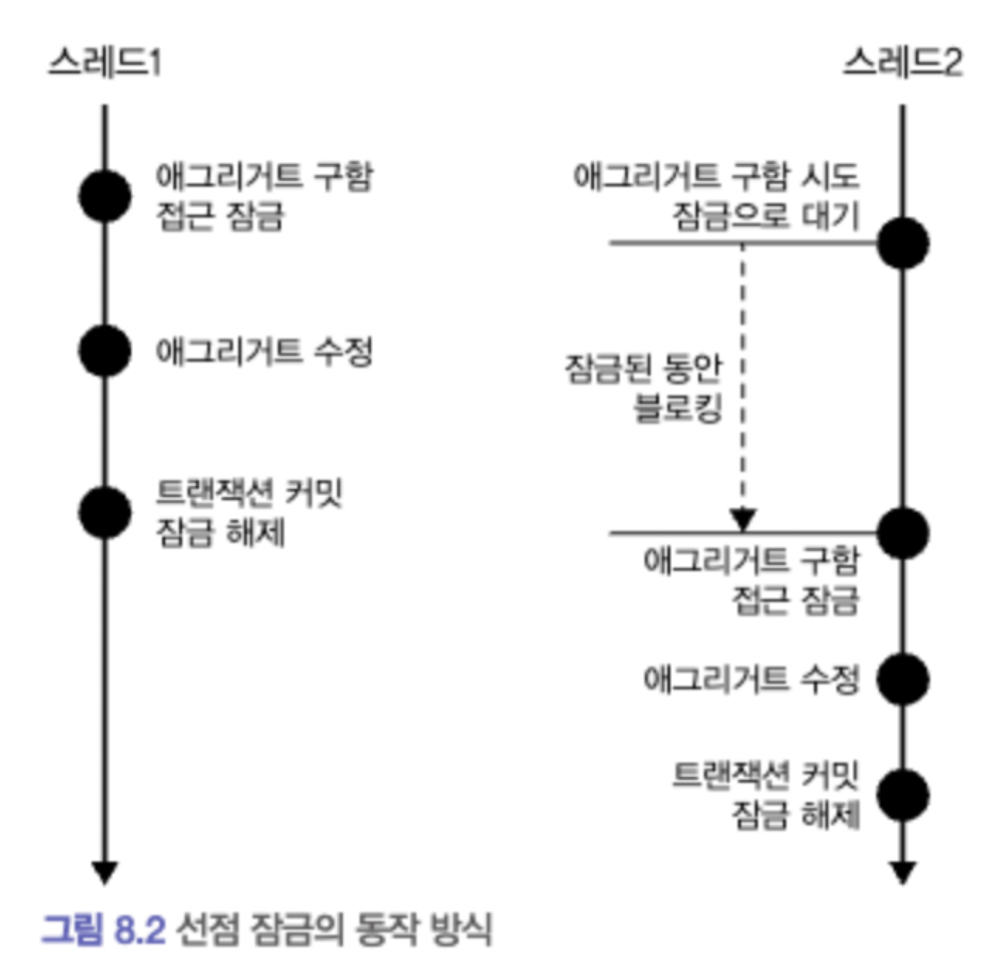
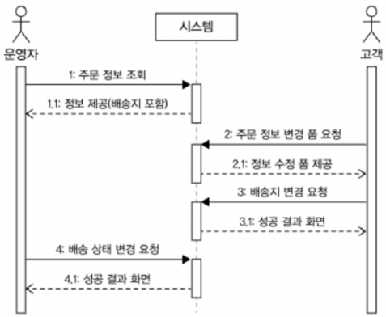
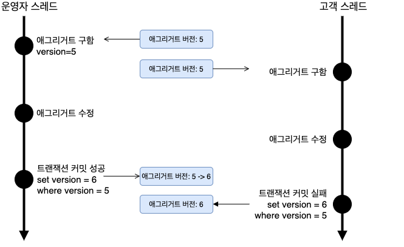
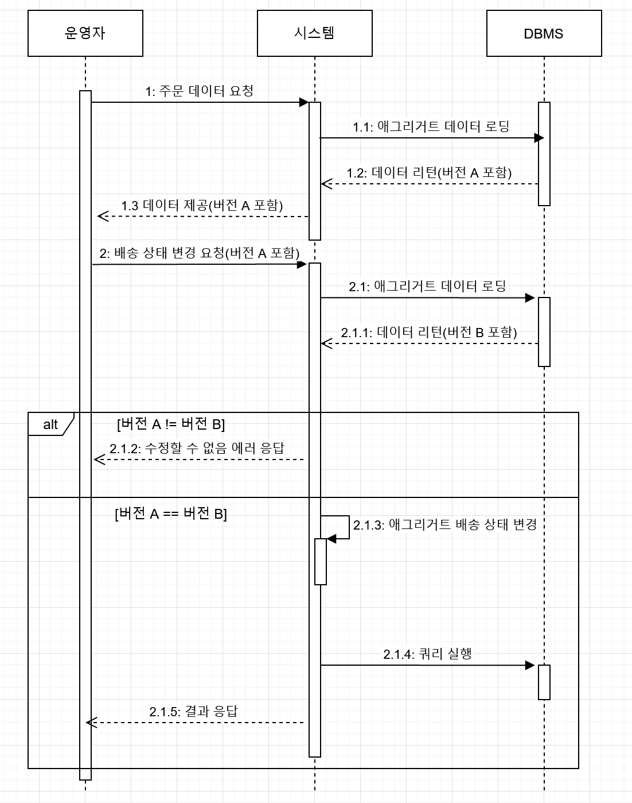
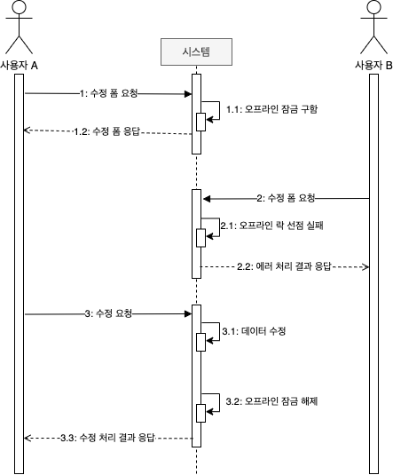

# 애그리거트 트랜잭션 관리

## 애그리거트와 트랜잭션
- 여러 스레드에서 각각 트랜잭션을 커밋할 때 수정한 내용을 DB에 반영한다.
  - 순서에 따라서 애그리거트의 일관성이 깨진다.
  - 일관성이 개지는 문제가 발생하지 않도록 하려면
1. 운영자가 배송지 정보를 조회하고, 상태를 변경하는 동안, 고객이 애그리거트를 수정하지 못하게 막는다.
2. 운영자가 배송지 정보를 조회한 이후에 고객이 정보를 변경하면, 운영자가 애그리거트를 다시 조회한 뒤 수정하도록 한다.

> - 선점(Pessimistic) 잠금 / 비선점(Optimistic) 잠금 두 가지 방식을 이용할 ㅅ ㅜ있다.
> - 비관적 잠금 / 낙관적 잠금 이라는 용어로 표현하기도 함.

## 선점 잠금

- 선점 잠금은 먼저 애그리거트를 구한 스레드가 애그리거트 사용이 끝날 때까지 다른 스레드가 해당 애그리거트를 수정하지 못하게 막는 방식.
  - 스레드2는 스레드1이 애그리거트에 대한 잠금을 해제할 때까지 블로킹 된다.
  - 선점 잠금은 보통 DBMS가 제공하는 행단위 잠금을 사용해서 구현한다.
    - for update
    - 특정 레코드에 한 커넥션만 접근 가능.

<pre>
<code>
// EntityManager > LockModeType.PESSIMISTIC_WRITE
entityManager.find(Order.class, orderNo, LockModeType.PESSIMISTIC_WRITE)

Spring Data Jpa > @Lock(LockModeType.PESSIMISTIC_WRITE)
</code>
</pre>

### 선점 잠금과 교착상태
- 선점 잠금 기능을 사용할 때 잠금 순서에 따른 교착 상태(deadlock)가 발생하지 않도록 주의해야 함.

1. 스레드 1 : A 애그리거트에 대한 선점 잠금 구함
2. 스레드 2 : B 애그리거트에 대한 선점 잠금 구함
3. 스레드 1 : B 애그리거트에 대한 선점 잠금 시도
3. 스레드 2 : A 애그리거트에 대한 선점 잠금 시도

- 이런 문제 방지를 위해 힌트를 주어 최대 대기 시간을 지정해야 함.
<pre>
<code>
Map<'String, Object> hints = Map.of("javax.persistence.lock.timeout", 2000)
entityManager.find(Order.class, orderNo, LockModeType.PESSIMISTIC_WRITE, hints)

@QueryHints({@QuertHint(name = "javax.persistence.lock.timeout", value = "2000)})
</code>
</pre>

> - DBMS에 따라 교착 상태에 빠진 커넥션을 처리하는 방식이 다르다.
> - 쿼리별로 대기 시간을 지정할 수 있는 DBMS가 있고, 커넥션 단위로만 대기 시간을 지정할 수 있는 DBMS도 있다.
> - 선점 잠금을 사용하려면 사용하는 DBMS에 대해 JPA가 어떤 식으로 대기 시간을 처리하는지 반드시 확인해야 한다.

## 비선점 잠금
  
- 선점 잠금으로 모든 트랜잭션 충돌 문제가 해결되는 것은 아니다.

> UPDATE aggtable SET version = version + 1, colx = ?, coly = ? WHERE aggid = ? and version = 현재버전
- 비선점 잠금
  - DBMS에 반영하는 시점에 변경 가능 여부를 확인하는 방식.

- @Version 애너테이션을 붙이고 매핑되는 테이블에 버전을 저장할 컬럼을 추가하면 된다.

<pre>
<code>
@Entity
@Table(name = "~")
@Access(~)
public class Order {
    ...

    @Version
    private long version;
}
</code>
</pre>

- JPA는 엔티티가 변경되어 UPDATE 쿼리를 실행할 때 @Version 에 명시한 필드를 이용해서 비선점 잠금 쿼리를 실행한다.
- 이는, 응용 서비스는 버전에 대해 알 필요가 없다.
    - 리포지터리에서 필요한 애그리거트를 구하고 알맞은 기능만 실행하면 된다.
    - 기능 실행 과정에서 애그리거트 데이터가 변경되면 JPA는 트랜잭션 종료 시점에 비선점 잠금을 위한 쿼리를 실행한다.
  - 비선점 잠금을 위한 쿼리를 실행할 때 쿼리 실행 결과로 수정된 행의 개수가 0 이면 이미 누군가 앞서 데이터를 수정한 것.
  - 이는 트랜잭션이 충돌한 것이므로 트랜잭션 종료 시점에 익셉션이 발생한다.
      - OptimisticLockingFailureException
  - 표현 영역 코드는 익셉션을 보고 판단 가능.
      -  ->>>> 이거를 표현계층에서 처리하는게 맞나

- 시스템은 사용자에게 수정 폼을 제공 시, 버전 정보를 제공하여, 폼을 서버에 전송할 때 이 버전을 함께 전송하여 트랜잭션 충돌 문제를 해소할 수 있다.
  
- 쿼리 실행 전 버전 체크!

### 강제 버전 증가
- 루트 엔티티의 값이 바뀌지 않더라도 애그리거트 구성 요소 중 일부 값이 바뀌면 논리적으로 그 애그리거트는 바뀐 것.
- 이런 상황에도 애그리거트의 버전 값이 증가해야 비선점 잠금이 올바르게 동작한다.
    - LockModeType.OPTIMISTIC_FORCE_INCREMENT
    - @Lock(LockModeType.OPTIMISTIC_FORCE_INCREMENT)

## 오프라인 선점 잠금
- 첫 번째 트랜잭션을 시작할 때 오프라인 잠금을 선점하고,
- 마지막 트랜잭션에 잠금을 해제한다.
- 잠금을 해제하기 전까지 다른 사용자는 잠금을 구할 수 없다.
  
- 뒤에 수정 요청을 하지 않으면 영원히 잠금을 구할 수 없는 상황이 발생
  - 잠금 유효 시간을 가져야 함.
  - 또한, 시간이 지나면 수정이 안되기에 일정 주기로 유효 시간을 증가시키는 방식이 필요.

### 오프라인 선점 잠금을 위한 LockManager 인터페이스와 관련 클래스
- 오프라인 선점은 크게 네 가지 기능이 필요.
  - 잠금 선점 시도
    - tryLock(type, id) : LockId
      - 해당 type / id 있으면 예외 | 없으면 inesrt
  - 잠금 확인
    - checkLock(LockId lockId)
      - 없으면 예외
  - 잠금 해제
    - releaseLock(LockId lockId)
      - delete
  - 잠금 유효시간 연장
    - extendLockExpiration(LockId lockId, long inc)
      - update

- 잠금을 선점하는데 실패하면 LockException
- 잠금을 선점한 이후에 실행하는 기능은 아래와 같은 상황을 고려하여 주어진 LockId를 갖는 잠금이 유효한지 확인해야 함.
  - 잠금 유효 시간이 지났으면 이미 다른 사용자가 잠금을 선점한다.
  - 잠금을 선점하지 않은 사용자가 기능을 실행했다면 기능 실행을 막아야 한다.

### DB를 이용한 LockManager 구현
<pre>
create table locks (
    `type` varchar(255),
    id varchar(255),
    lockid varchar(255)
    expiration_time datatime,
    primary key (`type`, id)
) character set utf8;

create unique index locks_idx ON locks (lockid);

--
insert into locks values ('Order', '1', '생성한lockid', ~);
</pre>