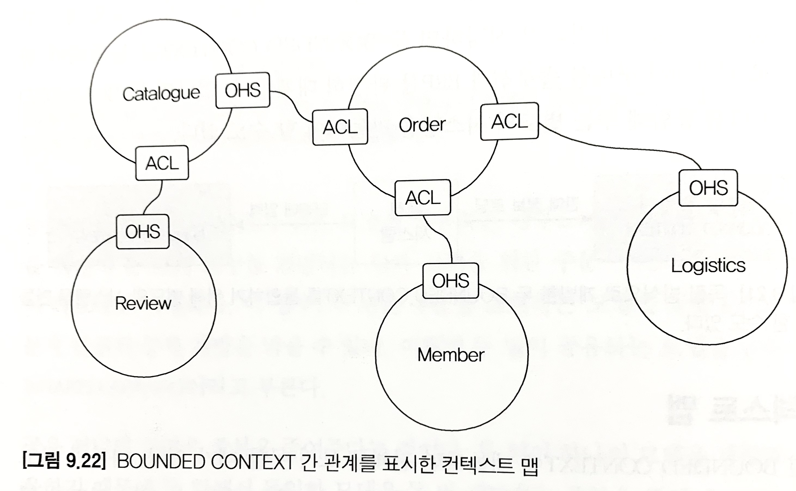

# 도메인 모델과 바운디드 컨텍스트

## 도메인 모델과 경계
- 처음 도메인 모델을 만들 때 빠지기 쉬운 함정이 도메인을 완벽하게 표현하는 단일 모델을 만드는 시도를 하는 것.
- 한 도메인은 다시 여러 하위 도메인으로 구분되기 때문에 한 개의 모델로 여러 하위 도메인을 모두 표현하려고 시도하면 오히려 모든 하위 도메인에 맞지 않는 모델을 만들게 된다.
- 하위 도메인마다 사용하는 용어가 다르기 때문에 올바른 도메인 모델을 개발하려면 **하위 도메인마다 모델**을 만들어야 한다.
  - 각 모델은 명시적으로 구분되는 경계를 가져서 섞이지 않도록 해야 한다.
  - 여러 하위 도메인의 모델이 섞이기 시작하면 모델의 의미가 약해질 뿐만 아니라 여러 도메인의 모델이 서로 얽히기 때문에 각 하위 도메인별로 다르게 발전하는 요구사항을 모델에 반영하기 어려워진다.
  - 모델은 특정한 컨텍스트(문맥) 하에서 완전한 의미를 갖는다.
    - 이렇게 구분되는 경계를 갖는 컨텍스트를 DDD에서는 `바운디드 컨텍스트(Bounded Context)`라고 부른다.

## 바운디드 컨텍스트
- 바운디드 컨텍스트는 모델의 경계를 결정하며, 한 개의 바운디드 컨텍스트는 논리적으로 한 개의 모델을 갖는다.
  - 바운디드 컨텍스트는 `용어를 기준`으로 구분한다.
- 이상적으로 하위 도메인과 바운디드 컨텍스트가 일대일 관계를 가지면 좋겠지만 기업의 팀 조직 구조에 따라 결정되기도 한다.
- 여러 하위 도메인을 한 개의 바운디드 컨텍스트에서 구현할 수 있다.
  - 이런 경우, 주의할 점은 하위 도메인의 모델이 섞이지 않도록 하는 것.
  - 한 프로젝트에 각 하위 도메인의 모델이 위치하면 아무래도 전체 하위 도메인을 위한 단일 메돌을 만들고 싶은 유혹에 빠지기 쉽다.
    - 도메인 모델이 개별 하위 도메인을 제대로 반영하지 못해서 하위 도메인별로 기능을 확장하기 어렵게 왼다.
  - 비록 한 개의 바운디드 컨텍스트가 여러 하위 도메인을 포함하더라도 하위 도메인마다 구분되는 패키지를 갖도록 구현해야 하며,
  - 이렇게 함으로써 하위 도메인을 위한 모델이 서로 뒤섞이지 않고 하위 도메인마다 바운디드 컨텍스트를 갖는 효과를 낼 수 있다.

## 바운디드 컨텍스트 구현
- 바운디드 컨텍스트가 도메인 모델만 포함하는 것은 아님.
  - 표현 / 응용 / 인프라스트럭처 / 테이블 모두 포함.

## 바운디드 컨텍스트 간 통합
- 기존 카탈로그 시스템에서 추천시스템을 추가한다면?
  - 카탈로그 하위 도메인에는 기존 카탈로그를 위한 바운디드 컨텍스트와 추천 기능을 위한 바운디드 컨텍스트가 생긴다.
  - 두 팀에서 관련된 바운디드 컨텍스트를 개발하면 자연스럽게 통합이 발생한다.
  - 카탈로그 / 추천에서는
  > 사용자가 제품 상세 페이지를 볼 때, 보고 있는 상품과 유사한 상품 목록을 하단에 보여준다.
- 카탈로그는 제품을 중심으로 도메인 모델을 구현하지만, 추천은 추천 연산을 위한 모델을 구현한다.
  - 추천 시스템은 상세 정보를 포함하지 않으며 상품 번호 대신 아이템 ID라는 용어를 사용해서 식별자를 표현하고 추천 순위와 같은 데이터를 담게 된다.
  - 추천 도메인 모델을 사용하기보다는 카탈로그 도메인 모델을 사용해서 추천 상품을 표현해야 한다.
    - 도메인 서비스를 구현한 클래스는 인프라스트럭처 영역에 위치.
    - 추천 시스템은 REST API를 이용해서 특정 상품을 위한 추천 상품 목록을 로딩.
      - 이는, 카탈로그 도메인 모델과 일치하지 않는 데이터를 제공할 것이다.
      - `[{itemId: 'PROD-1000', type: 'PRODUCT', rank: 100}, ...]`
      - 이를 읽어와 카탈로그 도메인에 맞는 상품 모델로 변환한다.
        - 필요하다면 별도의 변환 처리를 위한 클래스 생성
- REST API를 호출하는 것은 두 바운디드 컨텍스트를 직접 통합하는 방법이다.
- 직접 통합하는 대신 간접적으로 통합하는 방법은 바로바로 `메시지 큐`
  - 카탈로그 바운디드 컨텍스트는 추천 시스템이 필요로 하는 `사용자 활동 이력`을 메시지 큐에 추가.
  - 추천 바운디드 컨텍스트가 메시지를 큐에서 이력 메시지를 읽어와 추천을 계산하는 데 사용할 것.
    - 이것은 두 바운디드 컨텍스트가 사용할 메시지의 데이터 구조를 맞춰야 함을 의미함.
    - 어떤 도메인 관점에서 모델을 사용하느냐에 따라 두 바운디드 컨텍스트의 구현 코드가 달라지게 된다.

> - 마이크로 서비스는 개별 서비스를 독립된 프로세스로 실행하고 각 서비스가 REST API나 메시징을 이용해서 통신하는 구조를 갖는다.
> - 이런 마이크로서비스의 특징은 바운디드 컨텍스트와 잘 어울린다는 것.
> - 각 바운디드 컨텍스트는 모델의 경계를 형성하는데, 바운디드 컨텍스트를 마이크로서비스로 구현하면 자연스럽게 컨텍스트별로 모델이 분리된다.

## 바운디드 컨텍스트 간 관계
- 바운디드 컨텍스트는 어떤 식으로든 연결되기 때문에 두 바운디드 컨텍스트는 다양한 방식으로 관계를 맺는다.
- 보통 한 쪽에서 API를 제공하고 다른 한 쪽에서 그 API를 호출하는 관계 : REST API!!!
  - 이 관계에서 사용하는 바운디드 컨텍스트는 제공하는 바운디드 컨텍스트에 `의존`
- 하류(downstream) 컴포넌트인 카탈로그 컨텍스트는 상류(upstream) 컴포넌트인 추천 컨텍스트가 제공하는 데이터와 기능에 의존.
  - 추천 시스템이 제공하는 REST API의 인터페이스가 바뀌면 카탈로그 시스템의 코드도 바뀌게 된다.
- 상류 컴포넌트는 보통 하류 컴포넌트가 사용할 수 있는 통신 프로토콜을 정의하고, 이를 공개한다.
- 하류 팀이 다수 존재하면 여러 요구사항을 수용할 수 있는 API를 만들고, 이를 서비스 형태로 공개해서 서비스의 일관성을 유지할 수 있다.
  - 이런 서비스를 가리켜 `공개 호스트 서비스(OPEN HOST SERVICE)` 라고 한다.
    - 대표적인 예 : `검색`
      - 블로그, 카페, 게시판과 같은 서비스를 제공하는 포털에서
      - 검색 시스템은 상류 컴포넌트
      - 블로그, 카페, 게시판은 하류 컴포넌트가 된다.
- 상류 컴포넌트의 서비스는 상류 바운디드 컨텍스트의 도메인 모델을 따른다.
- 따라서 하류 컴포넌트는 상류 서비스의 모델이 자신의 도메인 모델에 영향을 주지 않도록 보호해 주는 완충 지대를 만들어야 한다.
- infra 영역에서 외부 시스템의 도메인 모델이 내 도메인 모델을 침범하지 않도록 막아주는 역할을 만들어준다.
  - 즉, 내 모델이 깨지는 것을 막아주는 `안티코럽션 계층`이 된다.
  - 여기서 두 바운디드 컨텍스트 간의 모델 변환 처리를 해 주기 때문에 영향이 적다.
- 두 바운디드 컨텍스트가 같은 모델을 공유하는 경우도 있음.
  - 운영자 / 고객의 주문
    - 이렇게 두 팀이 공유하는 모델을 `공유 커널(SHARED KERNEL)` 이라고 부른다.
    - 장점 : 중복 설계를 막을 수 있다.
    - 단점 : 한 팀에서 임의로 모델 변경하면 안되며, 두 팀이 밀접한 관계를 유지해야 함.
      - 장점보단 공유 커널로 인해 개발이 지연되고 정체되는 문제가 더 커지게 된다.
- `독립 방식(SEPARATE WAY)`
  - 서로 통합하지 않는 방식
  - 통합은 수동으로 이루어짐.
    - 운영자가 쇼핑몰 시스템에서 판매 정보를 보고 ERP 시스템에 직접 입력하는 방식.
  - 이런 방식은 한계가 있으므로, 규모가 커지기 시작하면 통합해야 함.

## 컨텍스트 맵
- 개별 바운디드 컨텍스트에 매몰되면 전체를 보지 못할 때가 있다.
- 전체 비지니스를 조망할 수 있는 지도가 필요한데 그것이 바로 `컨텍스트 맵`
  - 바운디드 컨텍스트 간의 관계를 표시한 것.

- 주요 애그리거트를 함께 표시하면 모델에 대한 관계가 더 명확히 드러난다.
- 오픈 호스트 서비스(OHS) / 안티코럽션 계층(ACL) 을 표시하여 관계를 이해하는데 도움을 준다.
- 컨텍스트 맵은 시스템의 전체 구조를 보여준다.
- 그리는 규칙은 따로 없다^^